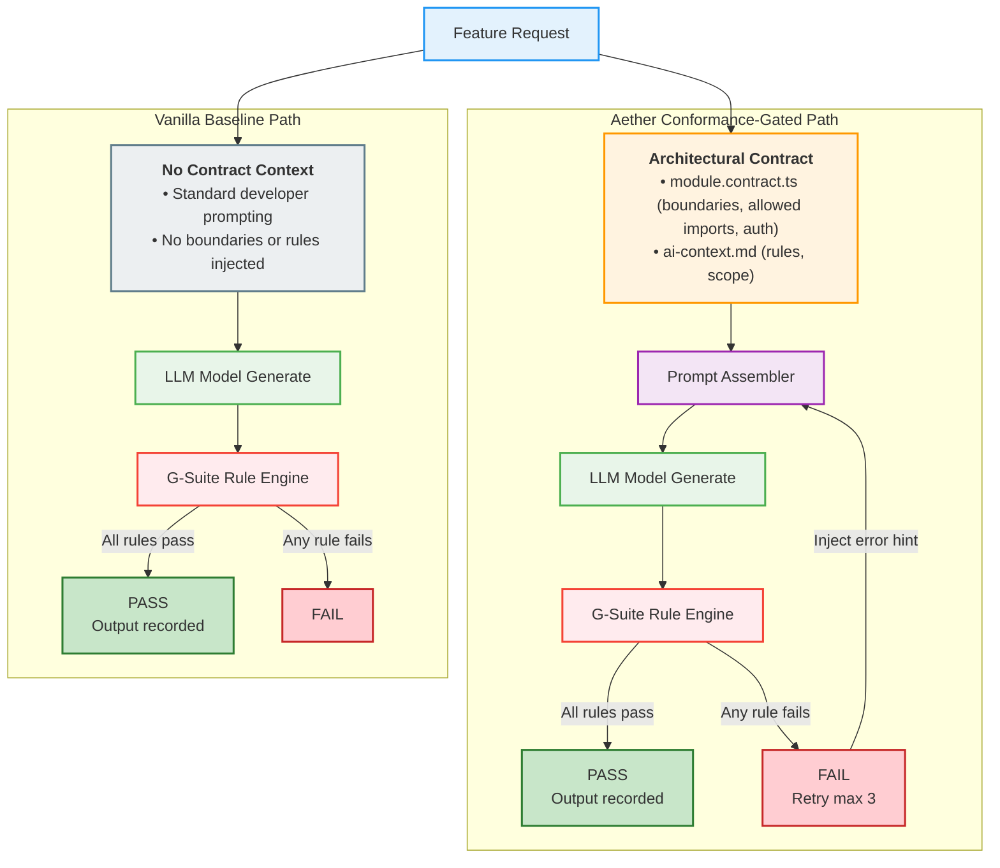
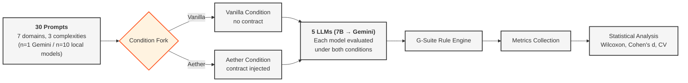
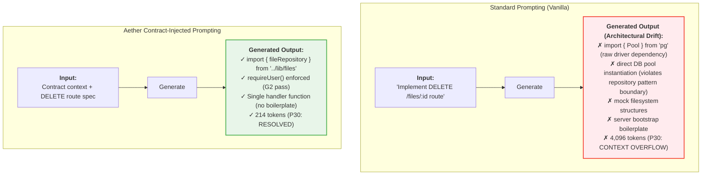

# Aether Framework: Architectural & Flow Diagrams

This file presents the raw Mermaid.js diagrams describing the framework design, experimental pipeline, and prompt comparison.

---

## Figure 1: Aether Framework Conformance-Gated Loop

---

## Figure 2: End-to-End Experimental Pipeline

---

## Figure 3: Vanilla vs. Aether Prompting Comparison (P30 Case)

*\*Note: Illustrated output represents qualitative generation patterns; formal G-Suite evaluation recorded 95.1% overall structural pass rate.*
